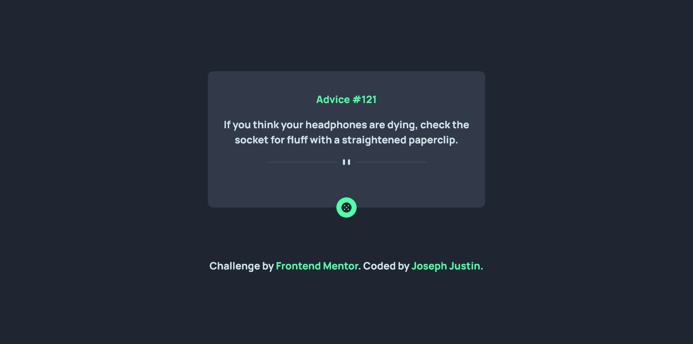
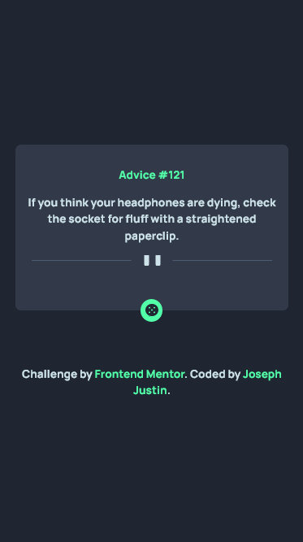

# Frontend Mentor - Advice generator app solution

This is a solution to the [Advice generator app challenge on Frontend Mentor](https://www.frontendmentor.io/challenges/advice-generator-app-QdUG-13db). Frontend Mentor challenges help you improve your coding skills by building realistic projects.

## Table of contents

- [Overview](#overview)
  - [The challenge](#the-challenge)
  - [Screenshot](#screenshot)
  - [Links](#links)
- [My process](#my-process)
  - [Built with](#built-with)
  - [What I learned](#what-i-learned)
  - [Continued development](#continued-development)
- [Author](#author)
- [Acknowledgments](#acknowledgments)

## Overview

### The challenge

Users should be able to:

- View the optimal layout for the app depending on their device's screen size
- See hover states for all interactive elements on the page
- Generate a new piece of advice by clicking the dice icon

### Screenshot




### Links

- [Solution Repo](https://github.com/JustinJoe/advice-generator)
- [Live Site](https://advice-generator-justinjoe.netlify.app/)

## My process
I started with looking at the design, breaking it down it into blocks, and then elements. This helped me write resusable rules for my CSS and also made it easier to structure my code for the mobile and desktop layouts. I then moved on to building out the HTML, CSS and JS.

### Built with

- Semantic HTML5 markup
- CSS custom properties
- Vanilla JavaScript
- Mobile-first workflow
- [Advice Slip API](https://api.adviceslip.com)

### What I learned

I learnt how to position a block or element with Position and Transform.

```html
<h1 class="position">Some HTML code I'm proud of</h1>
```
```css
.position {
  position: absolute,
  top: 50%;
  left: 50%;
  transform:translate(-50%, -50%)
}
```

### Continued development

I'll be reading more on positioning in CSS to get a better grasp on it.

## Author

- Frontend Mentor - [@JustinJoe](https://www.frontendmentor.io/profile/JustinJoe)
- Twitter - [@justinjoe6](https://www.twitter.com/justinjoe6)

## Acknowledgments

Thanks to Emmanuel Asaber and Fitzgerald Afful for the help and inspiration to go ahead and get this done.
